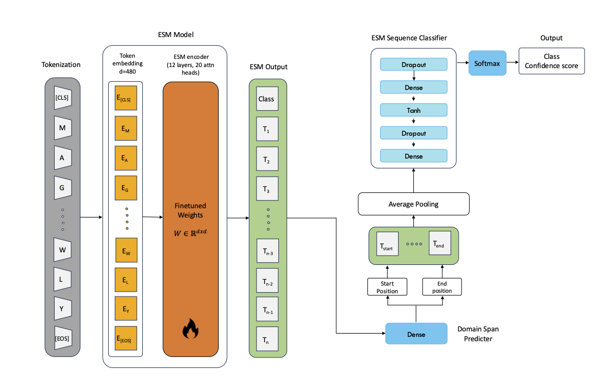

# SPIN (Scaling the Profile of lIfe by fuNction)

## 🚀 Overview

We implemented SPIN, a Transformer model inspired by ESM-2, for functionally classify proteins and predicting domain span from homologous sequences.
We experimented with two Protein families: Thioredoxin (TRX) and Cryptochrome/photolyase (CPF). We identify functional classes and subclasses with ProfileView (https://doi.org/10.1101/717249), handling thousands of sequences at a time to create comprehensive groups.
Our goal is to achieve large-scale classification of millions of proteins from extensive databases and ongoing high-throughput sequencing efforts. Moreover, it identifies conserved residues that are crucial for subfamilies, providing insights into the functional nuances of protein subclasses.

**Architecture**:

<p align="center">
  
</p>

**Results**:


Train 80%, Val 10 %, Test 10%

|  | Sequences | Classes | Train Accuracy | Train F1 | Val Accuracy | Val F1 | Test Accuracy | Test F1 | Dom Start (± 3) | Dom End (± 3) |
|:---:|:---:|:---:|:---:|:---:|:---:|:---:|:---:|:---:|:---:|:---:|
| TRX | 28601 | 8 | 0.957 ± 0.03 | 0.957 ± 0.03 | 0.906 ± 0.01 | 0.906 ± 0.01 | 0.895 ± 0.01 | 0.895 ± 0.01 | 0.823 | 0.819 |
| CPF | 14295 | 8 | 0.987 ± 0.004 | 0.987 ± 0.004 | 0.982 ± 0.002 | 0.982 ± 0.002 | 0.976 ± 0.004 | 0.976 ± 0.004 | 0.963 | 0.909 |

---
## 🛠️ Usage
Get started with just a few steps:

### 1️⃣ Clone the repository

   ```bash
   git clone http://gitlab.lcqb.upmc.fr/andrea.mancini/SPIN.git
   ```

### 2️⃣ Install dependencies

   ```bash
   conda create -n spin
   conda activate spin
   pip install -r requirements.txt
   ```

### 3️⃣ Download pretrained models

| Model     | # Classes | # tokens | # Epoch | #Val F1 score | # Checkpoint | 
|-----------|-----------|----------|---------|---------------|--------------|
| TRX model |     8     |   1024   |    7    |      0.92     | [🔗 Download](https://.pt) |
| CPF model |     8     |   1024   |    4    |      0.98     | [🔗 Download](https://.pt) |

### 4️⃣ Create dataset from ProfileView tree

Example of dataset.csv:

| id_seq (string)      | sequence (string) | start (int) Opt. | end (int) Opt. | group (string\|int) |
|----------------------|-------------------|------------------|----------------|---------------------|
| tr\|F0RTT8           | MSEIIVTEANFEQEVLK |        7         |       83       |        TRX-1        |

   ```bash
   create_dataset.py -f path_to_fasta -t path_to_nhx --depth val (optional) --nodes "Internal Node IDs list of subtrees" --class "Class IDs (only if passing a node list)" 
   ```
### 5️⃣ Train the model

   ```bash
   training.py -f path_to_csv --epochs 10 --batchsize 8 -v 2
   ```
### 7️⃣ Predict

   ```bash
   predict.py -f path_to_csv --ckptpath checkpoint.tar
   ```

### Example Jupyter nb

Open demo.ipynb for an example of inference with TRX